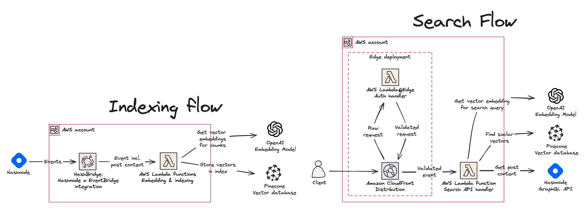
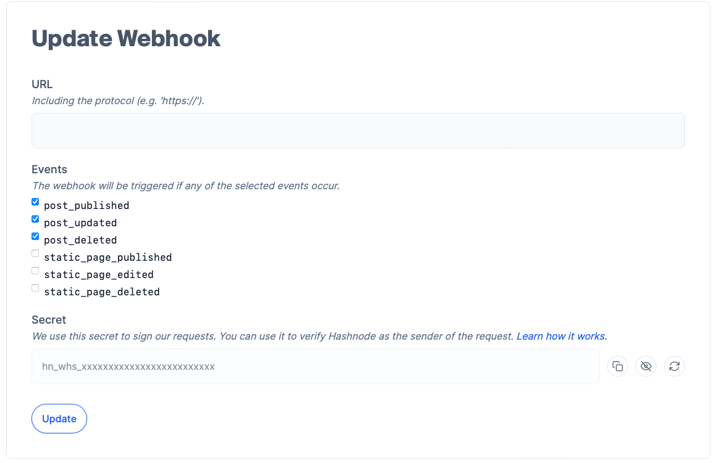
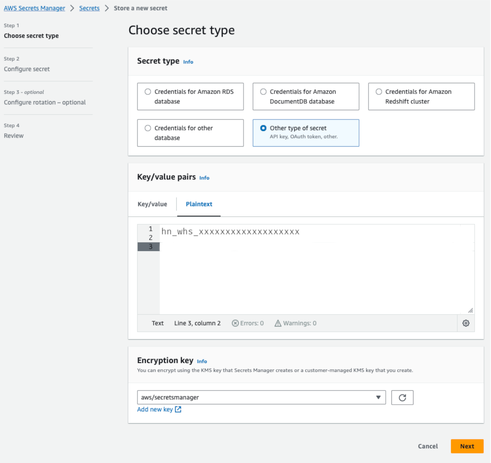
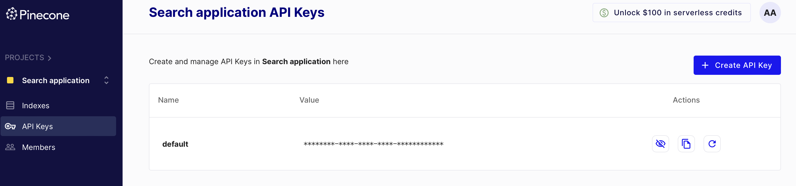
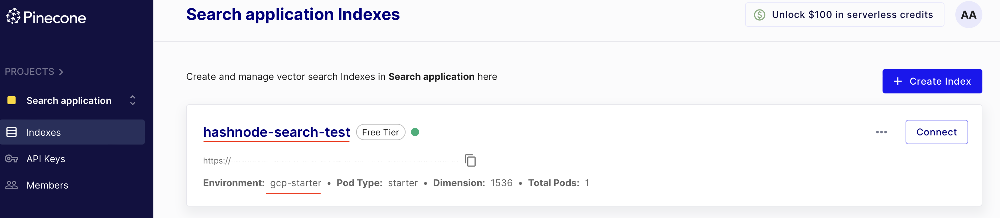
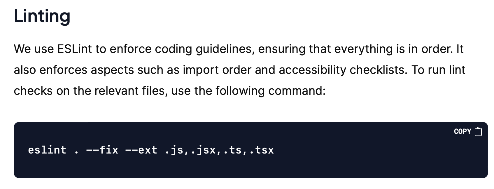
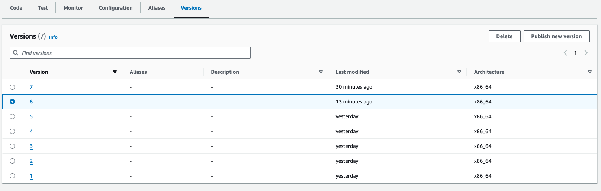

# Semantic search for your Hashnode blog using Pinecone, OpenAI and AWS

With this Pinecone x Hashnode integration you can easily set up semantic search for your Hashnode blog posts and query them using a serverless REST API endpoint.

To implement this, we rely on [Pinecone](https://www.pinecone.io/), a managed vector database, the [OpenAI](https://openai.com/) API for embedding models, and [AWS serverless services](https://aws.amazon.com/serverless/) to host the solution in your own AWS account.

This project builds on [HashBridge](https://github.com/dreamorosi/serverless-webhook-hashnode) which makes it easy to set up integrations between Hashnode and AWS serverless functions with AWS Lambda.

You can read about the details of the implementation in the blog post [Pinecone x Hashnode: add semantic search to your Hashnode blog posts](https://serverlesstypescript.com//pinecone-x-hashnode-add-semantic-search-to-your-hashnode-blog-posts) on Hashnode.



## Prerequisites

- An [AWS account](https://repost.aws/knowledge-center/create-and-activate-aws-account)
- Node.js v18.x or later
- AWS CLI (_optional_)
- A [Hashnode](https://hashnode.com/) blog
- A [Pinecone](https://www.pinecone.io/) account (free tier is sufficient)
- An [OpenAI](https://openai.com/) API key

### Create a Hashnode Webhook Secret

First, you need to obtain the Hashnode webhook secret. To do this, go to your blog's settings page and click on the "Webhooks" tab. Then, click on the "Add New Webhook" button.



For now, you can leave the "Webhook URL" field empty. You will get the URL later when you deploy the search engine. Copy the value displayed in the "Secret" field. This value will be used to verify that the webhook request is coming from Hashnode. Make sure to leave this page open for now.

### Store the Hashnode Webhook Secret

To avoid storing the Hashnode webhook secret in your source code, you can store it in [AWS Secrets Manager](https://aws.amazon.com/secrets-manager/). It's a good practice to handle secrets this way, as it also allows you to rotate the secret without having to redeploy your application.

If you have the AWS CLI installed, you can store the webhook secret in AWS Secrets Manager by running the following command and replacing the secret value with your own:

```bash
aws secretsmanager create-secret --name hashnode/webhook-secret --secret-string="hn_whs_xxxxxxxxxxxxxxxxxxx" --region us-east-1
```

If instead you prefer to store the secret in the AWS Secrets Manager console, you can follow the steps described in the [AWS Secrets Manager documentation](https://docs.aws.amazon.com/secretsmanager/latest/userguide/manage_create-basic-secret.html). When creating the secret, make sure to use the name `hashnode/webhook-secret`.



### Set up the Pinecone vector database

Pinecone is a managed vector database service that allows you to build a semantic search engine. You can sign up for a free account at [Pinecone](https://www.pinecone.io/). Once you have signed up, you will need to create an API key. You can do this by clicking on the "API Keys" tab in the Pinecone console and then clicking on the "Create API Key" button. Copy the API key and take note of it, as you will need it later.



Next, you will need to create a Pinecone index. You can do this by clicking on the "Indexes" tab in the Pinecone console and then clicking on the "Create Index" button. You can name the index whatever you like, but make sure to take note of the index name as you will need them in the next step.



Finally, create another secret in AWS Secrets Manager to store the Pinecone API key and index name. You can do this by running the following command and replacing the secret value with your own:

```bash
aws secretsmanager create-secret --name pinecone/connection-secret-config --secret-string='{"apiKey":"xxxxx-xxxxx-xxxx-xxxx-xxxxxxxxx","indexName":"hashnode-search-test"}'
```

Alternatively, you can store the secret in the AWS Secrets Manager console, following the steps described in the [AWS Secrets Manager documentation](https://docs.aws.amazon.com/secretsmanager/latest/userguide/manage_create-basic-secret.html). When creating the secret, make sure to use the name `pinecone/connection-secret-config` and use the AWS region in which you will deploy the search engine.

### Create an OpenAI API Key

You can sign up for a free account at [OpenAI](https://www.openai.com/). Once you have signed up, you will need to create an API key. You can do this by clicking on the "API Keys" tab in the OpenAI console and then clicking on the "Create API Key" button. Copy the API key and take note of it.

Next, create another secret in AWS Secrets Manager to store the OpenAI API key. You can do this by running the following command and replacing the secret value with your own:

```bash
aws secretsmanager create-secret --name openai/api-key --secret-string="sk-xxxxxxxxxxxxxxxxxxxxxxxx"
```

Alternatively, you can store the secret in the AWS Secrets Manager console, following the steps described in the [AWS Secrets Manager documentation](https://docs.aws.amazon.com/secretsmanager/latest/userguide/manage_create-basic-secret.html). When creating the secret, make sure to use the name `openai/api-key` and use the AWS region in which you will deploy the search engine.

> [!IMPORTANT]
> This solution deploys a number of resources into your AWS account, including a Amazon CloudFront distribution, AWS Lambda functions, and an Amazon EventBridge event bus. While the AWS Free Tier includes a number of these resources for free, you may incur charges if you exceed the free tier limits. For more information, see [AWS Free Tier](https://aws.amazon.com/free/). We also recommend you setting up a billing alarm to monitor your AWS charges. For more information, see [Creating a Billing Alarm](https://docs.aws.amazon.com/AmazonCloudWatch/latest/monitoring/monitor_estimated_charges_with_cloudwatch.html#monitor_estimated_charges_console).

## Deploy the semantic search engine

As a first step, clone this repository to your local machine:

```bash
git clone git@github.com:dreamorosi/serverless-semantic-search-hashnode.git
```

Next, install the dependencies:

```bash
cd serverless-semantic-search-hashnode
npm ci
```

Now, you can deploy the application to your AWS account by running the following command:

```bash
cdk deploy -- --all
```

```bash
 ✅  ServerlessWebhookApiStack

✨  Deployment time: 298.98s

Outputs:
ServerlessWebhookApiStack.distribution = https://dkzum3j6x4pzr.cloudfront.net
```

Copy the URL and go back to the Hashnode webhook settings page. Paste the URL in the "URL" field and make sure the events of type `post_*` are selected, then click on the "Save" button.

Congratulations! You have successfully deployed the semantic search engine and connected it to your Hashnode blog 🎉!

## Index existing blog posts

The solution will index new blog posts automatically, but you may want to index your existing blog posts as well. To do this, we have provided a script that you can run locally to index your existing blog posts.

To use it, you need to first update the url to your webhook endpoint and the hostname of your Hashnode blog in the `src/scripts/index-existing-posts.mts` file:

```typescript
const BLOG_HOST = "engineering.hashnode.com"; // <-- Update the hostname of your blog
const WEBHOOK_URL = "https://your-webhook-url.com"; // <-- Update this with the distribution URL you copied earlier
```

Then, you can run the script with the following command:

```bash
npm run index_existing_posts
```

After a few moments, you should see a log output similar to the following:

```bash
npm run index_existing_posts

> serverless-semantic-search-hashnode@1.0.0 index_existing_posts
> node -r esbuild-register src/scripts/index-existing-posts.mts

Found 31 posts
Successfully sent all posts to the webhook
```

## Testing the search engine

With the search engine deployed and the blog posts indexed, you can now test the search engine by running a query. To do this, you can use any HTTP client, such as Postman or [`httpie`](https://httpie.io/). Here's an example of how you can run a query using `httpie`:

```bash
http https://dkzum3j6x4pzr.cloudfront.net/search text=="what does hashnode use to schedule posts?"
```

Which returns a response similar to the following:

```json
{
  "matches": [
    {
      "post": {
        "author": {
          "name": "Sandro Volpicella",
          "username": "SandroVolpicella"
        },
        "brief": "One essential feature of any blogging platform is the ability to schedule posts for publication. Hashnode introduced this functionality in June 2022.\nAt that time, the entire feature was based on a CRON job. This CRON job managed all various states a...",
        "id": "65a68126b7de1c44080a3881",
        "title": "Setting Up Post Schedules with EventBridge Scheduler & CDK"
      },
      "similarity_score": 0.754142821
    },
    {
      "post": {
        "author": {
          "name": "Sandro Volpicella",
          "username": "SandroVolpicella"
        },
        "brief": "This article gives you an overview of the architecture of Hashnode. The goal of this article is to give you a broad architecture of our involved services.\nOverall Architecture\n\nThis is our overall architecture. A request starts on the user's side. It...",
        "id": "6524d6300881118bc31970bc",
        "title": "Hashnode's Overall Architecture"
      },
      "similarity_score": 0.667605937
    },
    {
      "post": {
        "author": {
          "name": "Sandro Volpicella",
          "username": "SandroVolpicella"
        },
        "brief": "Did you ever want to know what happens once you publish a post on hashnode? This is your chance. \nThis is the first post of the series: Building an Event-Driven-Architecture at Hashnode\nThis first post gives you an idea of what Event-Driven-Architect...",
        "id": "62f9e138be14cfbd5d7c7073",
        "title": "Building an Event-Driven Architecture at Hashnode."
      },
      "similarity_score": 0.653201044
    }
  ]
}
```

As you can see the blog post "[Setting Up Post Schedules with EventBridge Scheduler & CDK](https://engineering.hashnode.com/setting-up-post-schedules-with-eventbridge-scheduler-cdk)" is the most relevant to the query "what does hashnode use to schedule posts?" with a similarity score of `0.754142821`.

In this example, part of the input was somewhat similar to the title of the blog post, which is why it was the most relevant. You can try different queries to see how the search engine performs:

```bash
http https://dkzum3j6x4pzr.cloudfront.net/search text=="does hashnode lint its code?"
```

which returns:

```json
{
  "matches": [
    {
      "post": {
        "author": {
          "name": "Shad Mirza",
          "username": "iamshadmirza"
        },
        "brief": "How can you consistently deliver high-quality code that adheres to established coding guidelines and is free from errors?The solution lies in implementing tests and multiple checks for linting and type errors.\nThis may seem straightforward, but it re...",
        "id": "64d492016f3feecb8702c3b4",
        "title": "CI Checks: Ensuring Better Code Quality and Faster Deployment"
      },
      "similarity_score": 0.638337374
    },
    {
      "post": {
        "author": {
          "name": "Lakshya Thakur",
          "username": "lakbychance"
        },
        "brief": "Welcome to the first article of the series - Debugging Days At Hashnode\nIn this series, we are going to talk about one of the important aspects of software engineering - Debugging and how it helps us solving series of weird bugs at Hashnode.\nSetting ...",
        "id": "6267b4d448d65f908681b5b8",
        "title": "Stuck In The Middleware"
      },
      "similarity_score": 0.569042385
    },
    {
      "post": {
        "author": {
          "name": "Sandro Volpicella",
          "username": "SandroVolpicella"
        },
        "brief": "Did you ever want to know what happens once you publish a post on hashnode? This is your chance. \nThis is the first post of the series: Building an Event-Driven-Architecture at Hashnode\nThis first post gives you an idea of what Event-Driven-Architect...",
        "id": "62f9e138be14cfbd5d7c7073",
        "title": "Building an Event-Driven Architecture at Hashnode."
      },
      "similarity_score": 0.559377372
    }
  ]
}
```

In this case the most relevant blog post "[CI Checks: Ensuring Better Code Quality and Faster Deployment](https://engineering.hashnode.com/ci-checks-ensuring-better-code-quality-and-faster-deployment)" with a similarity score of `0.638337374` doesn't contain the exact words in the title nor in the brief, but by looking at the content of the blog post, it's clear that it's the most relevant to the query "does hashnode lint its code?"



## Cleanup

To delete the resources created by the HashBridge application, you can run the following command:

```bash
npm run cdk destroy -- --all
```

This command will delete all the resources created by the application, including the CloudFront distribution, the Lambda functions, and the EventBridge event bus.

Due to a limitation in CDK, the command will fail to delete the Lambda@Edge function. This happens because the function is replicated in all the AWS regions to allow for global distribution and CDK doesn't support deleting replicated functions (yet).

To delete the function open the AWS Lambda console in the `us-east-1` region and delete all versions of the function with name starting with `ServerlessWebhookAuthStack-authAtEdgeFn`.



When you get to the last version, you will get an error message saying that the function can't be deleted because it's replicated in other regions. This means that the function is still replicated in other regions. To delete the function, you need to wait for the replication to complete. This can take up to 30 minutes.

Once the last version of the function is deleted, you can run the following command again to delete the stack:

```bash
npm run cdk destroy -- --all
```
